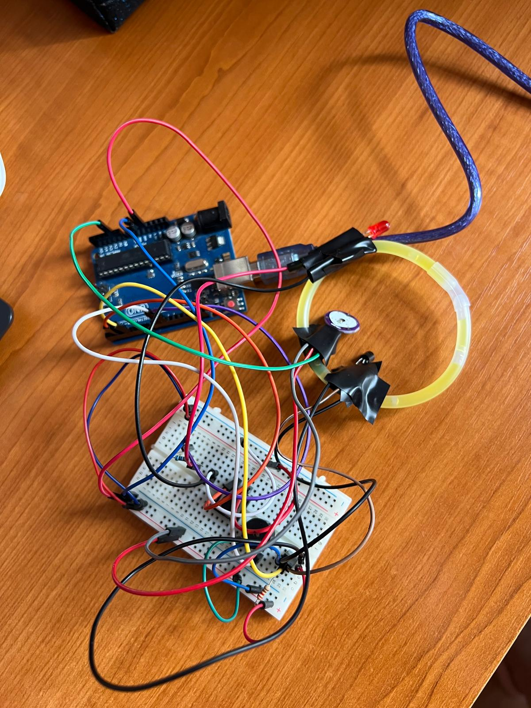

# Burn Out Bracelet


An Arduino-powered smart bracelet that monitors **temperature** and **stress levels**  
to help prevent burnout with vibration alerts, LED breathing exercises, and real-time feedback.

---

## 🌟 About the Project
This was **my first experience with Arduino** and was built as part of **Builders 101**,  
a program supported by **Launch Romania** and **How to Web**.

The bracelet combines multiple sensors to remind the user to take breaks, breathe, or move—  
helping reduce stress and avoid burnout.

Initially I planned to include **heart-rate variability (HRV) monitoring**,  
but I encountered numerous hardware and signal-processing issues.  
As a temporary workaround, I used an **arbitrary threshold value** in the code  
to simulate a high-stress condition for testing and demonstration purposes.
---

## ✨ Features
- **Temperature & Stress Monitoring** – DS18B20 and Grove GSR sensors.
- **Break Alerts** – Soft pulsing buzzer and vibration when thresholds are exceeded.
- **Breathing Exercise** – LED guides a 4-7-8 breathing pattern.
- **Future Mobile App** – Notifications, Pomodoro timer, daily/weekly summaries.

---

## 🔮 Future Features
- Bluetooth link with a companion mobile app for real-time data.
- Customizable vibration/LED alert patterns.
- Cloud data logging and long-term analytics.

---

## 🔌 Pinout / Wiring
| Component              | Arduino Pin | Notes                                      |
|------------------------|-----------:|--------------------------------------------|
| DS18B20 (Temp) Data    | 4          | +4.7 kΩ pull-up to 5 V/3.3 V               |
| RGB LED (PWM)          | 10         | Adjust pins as needed in code              |
| Push Button            | 2          | INPUT (with pull-up/down)                  |
| Buzzer                 | 9          | Used with `tone()`                         |
| Vibration Motor        | via MOSFET | Any digital pin, external power recommended |
| GSR Sensor             | A0/A1      | Depends on module                           |
| Bluetooth Module       | TX/RX      | For future mobile app                       |

---

## 🛠️ Hardware
- Arduino-compatible board  
- DS18B20 temperature sensor  
- Grove GSR Sensor  
- RGB LED  
- Coin vibration motor + MOSFET  
- Push button  
- Bluetooth module (future)

---

## 💻 Code
Main sketch: [`code/burnout_bracelet.ino`](code/burnout_bracelet.ino)


## ⚙️ Calibration / Thresholds

In `loop()` you’ll find:

```cpp
if (temperature > 34.13) { /* buzzer pulse */ }
```

This value was chosen **arbitrarily** as a placeholder  
while testing because HRV monitoring could not be implemented.

Adjust this threshold to fit your environment (e.g. 33.5–36 °C).

---

## 📸 Demo


---

## 📷 Build Photo

A look at the prototype wiring and components:


